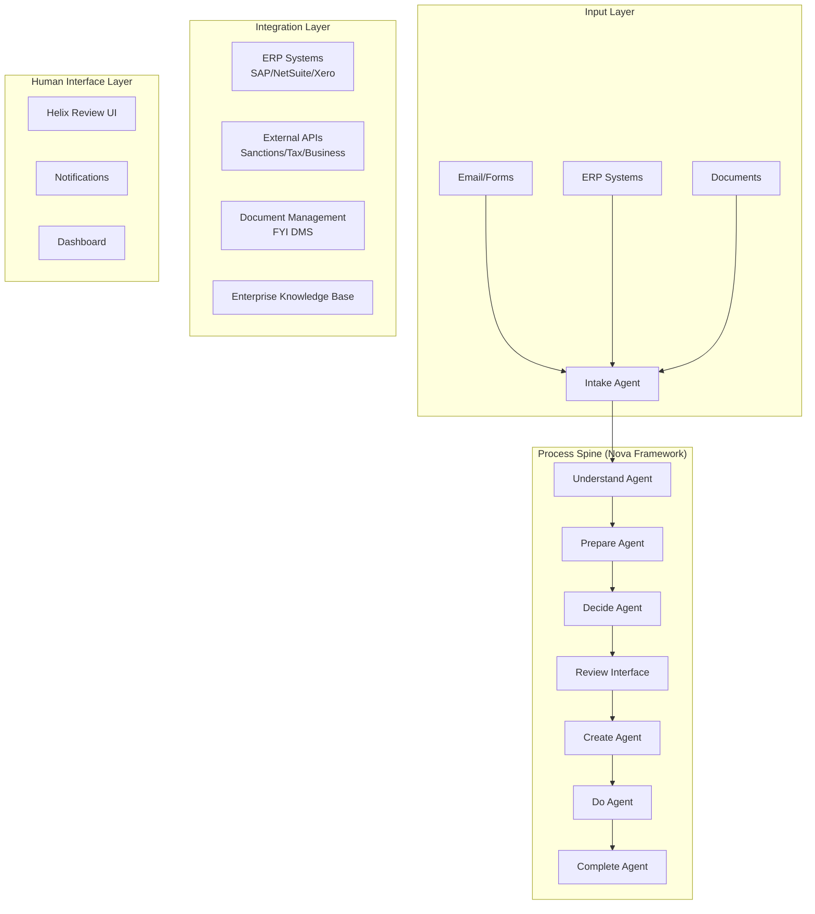

# Agentic Accounting Solution Blueprint
BLUEPRINT

## Executive Summary

This blueprint outlines a comprehensive agentic solution for automating accounting processes by combining intelligent agents, robotic process automation (RPA), and human-in-the-loop workflows. The solution addresses core accounting needs including vendor management, reconciliation, tax preparation, and financial reporting.

## Architecture Overview

### Core Components



## Process Blueprints

### 1. New Vendor Setup and Risk Scoring

#### Process Flow
```yaml
Stage_1_Intake:
  triggers:
    - email_submission
    - form_submission
    - erp_integration
  actions:
    - capture_vendor_request
    - validate_required_fields
    - create_process_instance

Stage_2_Understand:
  technology: [LLM, OCR]
  actions:
    - extract_company_name
    - extract_tax_id
    - parse_supporting_documents
    - identify_vendor_type

Stage_3_Prepare:
  integrations:
    - sanctions_screening_api
    - business_registration_check
    - d&b_credit_check
  actions:
    - enrich_vendor_data
    - normalize_formatting
    - validate_tax_id
    - check_duplicate_vendors

Stage_4_Decide:
  rules_engine:
    - country_risk_assessment
    - payment_terms_evaluation
    - credit_risk_scoring
  outputs:
    - risk_score: [low, medium, high]
    - routing_decision
    - required_approvals

Stage_5_Review:
  conditions:
    - if: risk_score in [medium, high]
      then: route_to_ap_analyst
    - if: missing_documents
      then: request_additional_info
  interface: helix_review_ui

Stage_6_Create:
  outputs:
    - vendor_profile_payload
    - w9_form_generation
    - nda_document
    - bank_details_form
  validations:
    - data_completeness_check
    - compliance_verification

Stage_7_Do:
  actions:
    - post_to_erp_system
    - update_vendor_master
    - configure_payment_terms
    - send_notifications

Stage_8_Complete:
  actions:
    - log_audit_trail
    - update_metrics
    - close_process
    - archive_documents
```

### 2. Automated Tax Return Preparation

#### Process Flow
```yaml
Stage_1_Trigger:
  prerequisites:
    - reconciliation_complete: true
    - account_type: defined
    - client_name: defined
  technology: [Co-Pilot, RPA]

Stage_2_Data_Collection:
  sources:
    - xero_accounting_system
    - myob_integration
    - fyi_document_store
  documents:
    - balance_sheet
    - profit_loss_statement
    - account_statements
    - prior_year_returns

Stage_3_Analysis:
  automated_checks:
    - yoy_variance_analysis:
        threshold: 10%
        accounts:
          - total_sales
          - gross_profit
          - total_wages
          - rent
          - net_profit
    - trend_analysis
    - anomaly_detection

Stage_4_Reconciliation:
  technology: [RPA, Co-Pilot, EKB]
  actions:
    - match_opening_balances
    - identify_discrepancies
    - generate_query_list
    - suggest_adjustments
  standards_compliance:
    - aasb_102_inventories
    - itaa_1997_section_70_45

Stage_5_Review_Preparation:
  outputs:
    - reconciliation_workpapers
    - variance_reports
    - adjustment_journals
    - audit_trail
  storage: fyi_dms

Stage_6_Accountant_Review:
  interface: review_dashboard
  actions:
    - approve_adjustments
    - resolve_queries
    - sign_off_reconciliation

Stage_7_Finalization:
  outputs:
    - draft_tax_return
    - financial_statements
    - client_communication
    - compliance_documents
```

## Technology Stack

### Core Technologies

| Component | Technology | Purpose |
|-----------|------------|---------|
| Process Orchestration | Nova Process Spine | Workflow management and stage coordination |
| Intelligent Agents | Co-Pilot AI | Decision making and analysis |
| Automation | RPA (UiPath/AA) | Repetitive task automation |
| Knowledge Base | Enterprise KB | Standards, rules, and procedures |
| Document Management | FYI DMS | Document storage and retrieval |
| Review Interface | Helix UI | Human review and approvals |

### Integration Architecture

```yaml
ERP_Integrations:
  supported_systems:
    - SAP:
        protocols: [RFC, REST API]
        data_sync: real-time
    - NetSuite:
        protocols: [SuiteTalk, REST API]
        data_sync: scheduled
    - Xero:
        protocols: [OAuth2, REST API]
        data_sync: webhook-based
    - MYOB:
        protocols: [OAuth2, REST API]
        data_sync: polling

External_APIs:
  compliance:
    - dun_bradstreet: credit_checks
    - refinitiv: sanctions_screening
    - irs_api: tin_validation
  document_processing:
    - ocr_service: document_extraction
    - e_signature: docusign_integration

Data_Storage:
  transactional: PostgreSQL
  documents: S3_compatible_storage
  analytics: data_warehouse
  cache: Redis
```

## Implementation Phases

### Phase 1: Foundation (Weeks 1-4)
- Set up Nova process spine
- Configure base integrations
- Establish security framework
- Deploy development environment

### Phase 2: Vendor Management (Weeks 5-8)
- Implement vendor setup blueprint
- Configure risk scoring rules
- Integrate sanctions screening
- Deploy review interfaces

### Phase 3: Reconciliation Automation (Weeks 9-12)
- Build reconciliation workflows
- Implement variance analysis
- Configure RPA bots
- Set up exception handling

### Phase 4: Tax Preparation (Weeks 13-16)
- Develop tax return workflows
- Integrate compliance checks
- Build audit trail system
- Configure reporting

### Phase 5: Optimization (Weeks 17-20)
- Performance tuning
- User acceptance testing
- Training and documentation
- Production deployment

## Key Features

### 1. Intelligent Process Routing
```python
class ProcessRouter:
    def route_vendor(self, vendor_data, risk_score):
        if risk_score.value > 70:
            return Route(
                path="high_risk_review",
                approvers=["senior_ap_analyst", "finance_manager"],
                sla_hours=24
            )
        elif risk_score.value > 40:
            return Route(
                path="standard_review",
                approvers=["ap_analyst"],
                sla_hours=48
            )
        else:
            return Route(
                path="auto_approve",
                approvers=[],
                sla_hours=1
            )
```

### 2. Compliance Engine
```yaml
compliance_rules:
  vendor_screening:
    - ofac_sanctions_check
    - pep_screening
    - adverse_media_search
  
  tax_compliance:
    - aasb_standards_validation
    - itaa_requirements
    - state_tax_obligations
  
  audit_requirements:
    - transaction_logging
    - approval_tracking
    - change_history
```

### 3. Exception Handling
```python
class ExceptionHandler:
    def handle_reconciliation_mismatch(self, account, discrepancy):
        if discrepancy.type == "timing_difference":
            return self.create_adjustment_entry(account, discrepancy)
        elif discrepancy.type == "missing_document":
            return self.request_source_document(account)
        else:
            return self.escalate_to_accountant(account, discrepancy)
```

## Metrics and KPIs

### Process Metrics
- **Vendor Setup Time**: Target < 4 hours (from 2-3 days)
- **Reconciliation Accuracy**: Target > 98%
- **Tax Return Processing**: Target < 2 days (from 1 week)
- **First-Time-Right Rate**: Target > 95%

### Business Metrics
- **Cost Reduction**: 60-70% reduction in manual effort
- **Compliance Rate**: 100% adherence to policies
- **Audit Readiness**: Real-time audit trail availability
- **ROI**: 6-month payback period

## Risk Management

### Technical Risks
| Risk | Mitigation |
|------|------------|
| Integration Failures | Circuit breakers, retry logic, fallback procedures |
| Data Quality Issues | Validation rules, data cleansing, exception handling |
| System Downtime | High availability, disaster recovery, manual fallback |

### Compliance Risks
| Risk | Mitigation |
|------|------------|
| Regulatory Changes | Configurable rules engine, regular updates |
| Audit Findings | Comprehensive logging, approval workflows |
| Data Privacy | Encryption, access controls, data masking |

## Success Factors

### Critical Success Factors
1. **Executive Sponsorship**: Strong support from CFO/Controller
2. **Change Management**: Comprehensive training program
3. **Data Quality**: Clean master data and well-defined processes
4. **Integration Readiness**: APIs and access to source systems
5. **Continuous Improvement**: Regular process optimization

### Governance Structure
```yaml
steering_committee:
  - cfo: executive_sponsor
  - controller: business_owner
  - it_director: technical_owner
  - compliance_head: risk_owner

working_groups:
  - process_owners: accounting_managers
  - technical_team: developers_and_architects
  - training_team: change_management
  - support_team: help_desk
```

## Future Enhancements

### Planned Capabilities
1. **Predictive Analytics**: Cash flow forecasting, spend analytics
2. **Advanced AI**: Natural language queries, intelligent document processing
3. **Mobile Access**: Approval workflows on mobile devices
4. **Blockchain Integration**: Immutable audit trails
5. **Real-time Reporting**: Live dashboards and alerts

### Expansion Opportunities
- **Invoice Processing**: OCR, matching, and approval workflows
- **Expense Management**: Receipt processing, policy compliance
- **Financial Close**: Automated journal entries, balance sheet reconciliation
- **Contract Management**: Extraction, obligation tracking, renewal alerts

## Conclusion

This Agentic Accounting Solution provides a comprehensive framework for automating core accounting processes while maintaining compliance, accuracy, and control. By leveraging intelligent agents, RPA, and human-in-the-loop workflows, organizations can achieve significant efficiency gains while reducing risk and improving financial operations.
