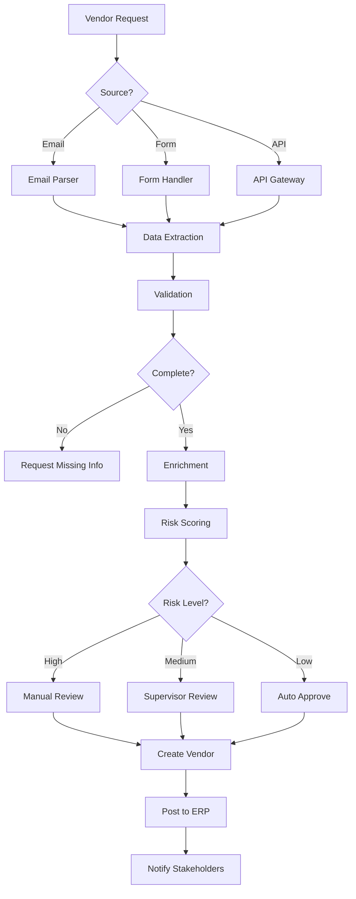

# Agentic Accounting Solution - Implementation Roadmap
BLUEPRINT

## Executive Overview

This roadmap provides a detailed implementation plan for the Agentic Accounting Solution, combining the Nova process framework with intelligent automation to transform accounting operations.

## Phase-wise Implementation Plan

### Phase 1: Foundation & Infrastructure 

####  Environment Setup
```yaml
Infrastructure:
  Development:
    - servers: 3x application, 1x database, 1x integration
    - storage: 500GB for documents
    - networking: VPN setup for secure access
  
  Security:
    - authentication: OAuth2/SAML integration
    - encryption: TLS 1.3 for transit, AES-256 for storage
    - access_control: Role-based permissions
  
  Monitoring:
    - logging: ELK stack setup
    - metrics: Prometheus + Grafana
    - alerts: PagerDuty integration
```

#### Core Framework Setup
- Install Nova Process Spine
- Configure workflow orchestrator
- Set up development environments
- Establish CI/CD pipelines
- Create base agent templates

### Phase 2: Vendor Management Module 

####  Process Design


####  Integration Development
```python
# Sample Integration Code Structure
class VendorIntegration:
    def __init__(self):
        self.erp_connectors = {
            'sap': SAPConnector(),
            'netsuite': NetSuiteConnector(),
            'xero': XeroConnector()
        }
        self.api_clients = {
            'sanctions': SanctionsAPIClient(),
            'business_registry': BusinessRegistryClient(),
            'credit_check': DunBradstreetClient()
        }
    
    async def process_vendor(self, vendor_data):
        # Extract and validate
        validated_data = await self.validate_vendor_data(vendor_data)
        
        # Enrich with external data
        enriched_data = await self.enrich_vendor_data(validated_data)
        
        # Calculate risk score
        risk_score = await self.calculate_risk_score(enriched_data)
        
        # Route based on risk
        return await self.route_vendor_workflow(enriched_data, risk_score)
```

####  Rule Engine Configuration
```yaml
risk_scoring_rules:
  country_risk:
    high_risk_countries: [country_list]
    weight: 0.3
  
  payment_terms:
    rules:
      - condition: "terms > 60 days"
        score: 20
      - condition: "terms > 90 days"
        score: 40
    weight: 0.2
  
  business_verification:
    unverified: 50
    verified: 0
    weight: 0.3
  
  sanctions_check:
    match: 100
    no_match: 0
    weight: 0.2

routing_rules:
  - condition: "risk_score >= 70"
    action: "route_to_senior_analyst"
    sla: "4 hours"
  
  - condition: "risk_score >= 40"
    action: "route_to_analyst"
    sla: "8 hours"
  
  - condition: "risk_score < 40"
    action: "auto_approve"
    sla: "1 hour"
```

#### Testing & Optimization
- Unit testing of all components
- Integration testing with ERP systems
- Performance optimization
- User acceptance testing
- Documentation completion

### Phase 3: Reconciliation Automation (Weeks 9-12)

#### Reconciliation Workflow Design
```yaml
reconciliation_process:
  1_data_collection:
    sources:
      - bank_statements
      - general_ledger
      - sub_ledgers
    format: standardized_csv
  
  2_matching_engine:
    algorithms:
      - exact_match
      - fuzzy_match
      - date_range_match
    tolerance: 0.01
  
  3_exception_handling:
    types:
      - amount_mismatch
      - missing_transaction
      - duplicate_entry
    resolution:
      - auto_adjust
      - create_journal
      - manual_review
  
  4_reporting:
    outputs:
      - reconciliation_report
      - exception_report
      - audit_trail
```

#### RPA Bot Development
```python
# RPA Bot Structure
class ReconciliationBot:
    def __init__(self):
        self.data_sources = DataSourceManager()
        self.matching_engine = MatchingEngine()
        self.exception_handler = ExceptionHandler()
    
    async def execute_reconciliation(self, account_type, period):
        # Step 1: Collect data
        bank_data = await self.collect_bank_data(account_type, period)
        ledger_data = await self.collect_ledger_data(account_type, period)
        
        # Step 2: Perform matching
        matches, exceptions = await self.matching_engine.match(
            bank_data, ledger_data
        )
        
        # Step 3: Handle exceptions
        resolutions = await self.exception_handler.process(exceptions)
        
        # Step 4: Generate reports
        return await self.generate_reports(matches, resolutions)
```

#### Analytics Integration
- Variance analysis implementation
- Trend detection algorithms
- Anomaly detection setup
- Dashboard creation
- Alert configuration

####  Testing & Deployment
- End-to-end testing
- Performance benchmarking
- Pilot deployment
- User training
- Process documentation

### Phase 4: Tax Automation (Weeks 13-16)

####  Tax Process Mapping
```yaml
tax_preparation_workflow:
  prerequisites:
    - all_accounts_reconciled
    - supporting_documents_collected
    - prior_year_returns_available
  
  data_preparation:
    - trial_balance_generation
    - adjustment_entries
    - tax_basis_conversion
  
  compliance_checks:
    - aasb_standards
    - tax_legislation
    - jurisdiction_requirements
  
  return_preparation:
    - form_population
    - schedule_generation
    - disclosure_notes
  
  review_process:
    - automated_checks
    - professional_review
    - client_approval
```

####Compliance Engine
- Tax rule configuration
- Jurisdiction mapping
- Form template setup
- Calculation engine
- Validation rules

#### Integration & Testing
- Tax software integration
- Government portal connectivity
- Document generation
- E-filing capabilities
- Compliance testing

#### Deployment & Training
- Production deployment
- User training sessions
- Documentation finalization
- Support structure setup
- Performance monitoring

### Phase 5: Advanced Features (Weeks 17-20)

#### AI/ML Enhancements
```python
# AI Enhancement Examples
class IntelligentAutomation:
    def __init__(self):
        self.nlp_engine = NLPEngine()
        self.ml_models = {
            'categorization': TransactionCategorizer(),
            'anomaly': AnomalyDetector(),
            'prediction': CashFlowPredictor()
        }
    
    async def enhance_process(self, process_type, data):
        if process_type == 'invoice_processing':
            return await self.intelligent_invoice_processing(data)
        elif process_type == 'expense_categorization':
            return await self.ml_models['categorization'].predict(data)
        elif process_type == 'fraud_detection':
            return await self.ml_models['anomaly'].detect(data)
```

####  Mobile & Reporting
- Mobile app development
- Real-time dashboards
- Custom report builder
- Automated insights
- Notification system

####  Performance Optimization
- Query optimization
- Caching implementation
- Load balancing
- Scalability testing
- Disaster recovery setup

####  Go-Live Preparation
- Final testing
- Production cutover
- Monitoring setup
- Support team training
- Success metrics tracking

## Resource Requirements

### Team Composition
```yaml
core_team:
  project_manager: 1
  solution_architect: 1
  developers: 4
  rpa_developers: 2
  integration_specialists: 2
  business_analysts: 2
  qa_engineers: 2
  
support_team:
  accounting_smes: 3
  change_managers: 1
  trainers: 2
  technical_writers: 1
```

### Technology Stack
```yaml
process_orchestration:
  - nova_process_spine
  - camunda_workflow_engine

automation:
  - uipath_rpa
  - python_automation_scripts

integration:
  - mulesoft_anypoint
  - apache_kafka
  - rest_apis

ai_ml:
  - azure_cognitive_services
  - tensorflow
  - scikit_learn

databases:
  - postgresql
  - mongodb
  - redis

monitoring:
  - elk_stack
  - prometheus_grafana
  - new_relic
```

## Success Metrics

### Process Metrics
| Metric | Baseline | Target | Measurement |
|--------|----------|--------|-------------|
| Vendor Setup Time | 2-3 days | < 4 hours | End-to-end time |
| Reconciliation Accuracy | 85% | > 98% | Matched transactions |
| Tax Return Processing | 1 week | < 2 days | Submission time |
| Manual Intervention | 80% | < 20% | Automated decisions |

### Business Metrics
| Metric | Target | Measurement Period |
|--------|--------|-------------------|
| Cost Reduction | 60% | 12 months |
| Error Rate | < 2% | Monthly |
| Compliance Rate | 100% | Quarterly |
| User Satisfaction | > 4.5/5 | Quarterly |

## Risk Mitigation

### Technical Risks
```yaml
integration_failure:
  mitigation:
    - fallback_procedures
    - manual_override_options
    - gradual_rollout
  
data_quality:
  mitigation:
    - validation_rules
    - exception_handling
    - data_cleansing_processes

system_availability:
  mitigation:
    - high_availability_setup
    - disaster_recovery_plan
    - regular_backups
```

### Change Management
```yaml
user_adoption:
  strategies:
    - comprehensive_training
    - champion_network
    - phased_rollout
    - continuous_support

process_resistance:
  strategies:
    - stakeholder_engagement
    - benefit_demonstration
    - feedback_incorporation
    - success_celebration
```

## Post-Implementation Support

### Support Structure
- Level 1: Help desk (basic queries)
- Level 2: Technical support (system issues)
- Level 3: Development team (enhancements)
- Level 4: Vendor support (third-party issues)

### Continuous Improvement
- Monthly process reviews
- Quarterly optimization sprints
- Annual strategic assessment
- User feedback integration

## Conclusion

This implementation roadmap provides a structured approach to deploying the Agentic Accounting Solution. Success depends on careful planning, stakeholder engagement, and iterative improvement based on real-world usage and feedback.
