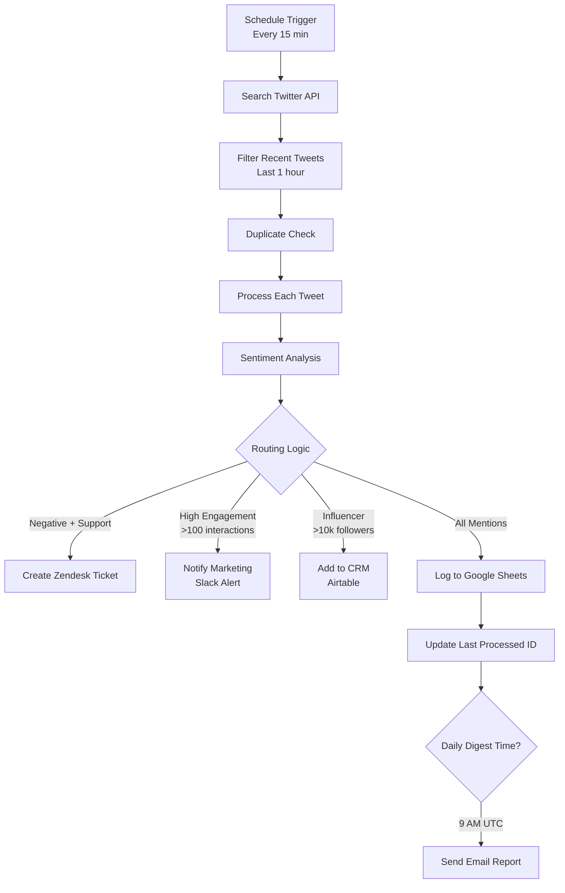

# Social Media Brand Monitoring Workflow - Analytos

## Overview

This Activepieces workflow provides comprehensive social media monitoring for the Analytos brand on Twitter. It runs every 15 minutes to capture brand mentions, analyze sentiment, categorize content, and route to appropriate channels based on configurable business rules.

## Features

### Core Functionality
- **Scheduled Monitoring**: Runs every 15 minutes via cron schedule
- **Brand Keyword Tracking**: Monitors mentions of `@analytos`, `analytos.ai`, and `#analytos`
- **Smart Filtering**: Excludes retweets and processes only recent mentions (within 1 hour)
- **Sentiment Analysis**: AI-powered sentiment scoring and categorization
- **Intelligent Routing**: Automated distribution based on content type and urgency

### Advanced Features
- **Duplicate Detection**: Prevents processing the same tweet multiple times
- **Rate Limiting**: Respects API limits for all integrated services
- **Error Handling**: Comprehensive retry logic and error monitoring
- **Daily Digest**: Automated summary email at 9 AM UTC

## Workflow Architecture



## Configuration

### Required Connections

1. **Twitter API**
   - OAuth 2.0 authentication
   - Requires Elevated access for search functionality
   - Rate limit: 180 requests per 15-minute window

2. **OpenAI API**
   - For sentiment analysis
   - Model: GPT-3.5-turbo
   - Temperature: 0.3 for consistent categorization

3. **Zendesk**
   - OAuth 2.0 authentication
   - Custom fields: sentiment_score, twitter_handle
   - Auto-tags: twitter, social_support, negative_sentiment

4. **Slack**
   - OAuth 2.0 with bot permissions
   - Required scopes: chat:write, channels:read
   - Target channel: #social-alerts

5. **Google Sheets**
   - OAuth 2.0 authentication
   - Required permissions: spreadsheets.read/write
   - Dashboard structure (see below)

6. **Airtable**
   - API key authentication
   - Base for influencer CRM tracking

7. **SendGrid**
   - API key for daily digest emails

### Environment Variables

```json
{
  "dashboardSpreadsheetId": "your-google-sheets-id",
  "influencerCRMBaseId": "your-airtable-base-id",
  "influencerCRMTableId": "your-airtable-table-id",
  "dashboardUrl": "https://docs.google.com/spreadsheets/d/...",
  "errorWebhookUrl": "https://your-monitoring-endpoint",
  "monitoringApiKey": "your-monitoring-api-key"
}
```

## Google Sheets Dashboard Structure

### Sheet: "Mentions"
| Column | Field | Description |
|--------|-------|-------------|
| A | Timestamp | Processing timestamp |
| B | Tweet ID | Unique tweet identifier |
| C | Username | Twitter handle (with @) |
| D | Followers | Follower count |
| E | Tweet Text | Full tweet content |
| F | Sentiment | positive/negative/neutral |
| G | Score | Sentiment score (0-100) |
| H | Category | support_request/complaint/praise/general |
| I | Likes | Like count |
| J | Retweets | Retweet count |

### Sheet: "DailyStats"
| Cell | Metric | Formula |
|------|--------|---------|
| B2 | Total Mentions | `=COUNTIF(Mentions!A:A,TODAY())` |
| B3 | Positive | `=COUNTIFS(Mentions!A:A,TODAY(),Mentions!F:F,"positive")` |
| B4 | Negative | `=COUNTIFS(Mentions!A:A,TODAY(),Mentions!F:F,"negative")` |
| B5 | Neutral | `=COUNTIFS(Mentions!A:A,TODAY(),Mentions!F:F,"neutral")` |
| B6 | Support Requests | `=COUNTIFS(Mentions!A:A,TODAY(),Mentions!H:H,"support_request")` |
| B7 | High Engagement | `=COUNTIFS(Mentions!A:A,TODAY(),Mentions!I:I,">100")` |
| B8 | Influencer Mentions | `=COUNTIFS(Mentions!A:A,TODAY(),Mentions!D:D,">10000")` |

## Routing Logic Details

### 1. Negative Support Requests
- **Condition**: Sentiment = "negative" AND Category = "support_request"
- **Action**: Create high-priority Zendesk ticket
- **Ticket Details**:
  - Subject: "Twitter Support Request - @username"
  - Priority: High
  - Tags: twitter, social_support, negative_sentiment
  - Custom fields populated with sentiment data

### 2. High Engagement Posts
- **Condition**: Total engagement (likes + retweets) > 100
- **Action**: Send Slack notification to #social-alerts
- **Notification includes**:
  - Engagement metrics
  - Tweet content
  - Direct link to Twitter
  - Sentiment analysis results

### 3. Influencer Mentions
- **Condition**: Author has > 10,000 followers
- **Action**: Add to Airtable CRM
- **Recorded Data**:
  - Username and verification status
  - Follower count
  - First mention date
  - Tweet link
  - Sentiment and engagement scores

### 4. All Mentions
- **Action**: Log to Google Sheets dashboard
- **Purpose**: Comprehensive tracking and analytics

## Rate Limiting Configuration

```json
{
  "twitter": {
    "requestsPerWindow": 180,
    "windowDuration": 900000,  // 15 minutes
    "strategy": "sliding-window"
  },
  "zendesk": {
    "requestsPerWindow": 200,
    "windowDuration": 60000    // 1 minute
  },
  "slack": {
    "requestsPerWindow": 50,
    "windowDuration": 60000    // 1 minute
  }
}
```

## Error Handling

### Retry Policy
- Maximum attempts: 3
- Backoff multiplier: 2
- Initial interval: 1 second

### Error Monitoring
All errors are logged to an external monitoring service with:
- Workflow name
- Error message and context
- Failed step identification
- Timestamp

### Duplicate Detection
- Uses persistent storage with 24-hour expiration
- Key format: `processed_tweet_{tweet_id}`
- Prevents reprocessing of tweets

## Daily Digest Email

### Schedule
- Sent daily at 9:00 AM UTC
- Only triggers during the 9:00 AM execution cycle

### Email Contents
- Total mentions count
- Sentiment breakdown (positive/negative/neutral)
- Support request count
- High engagement post count
- Influencer mention count
- Link to full dashboard

## Setup Instructions

1. **Import Workflow**
   - Copy the JSON file to your Activepieces instance
   - Navigate to Workflows > Import
   - Upload the JSON file

2. **Configure Connections**
   - Connect Twitter account with elevated access
   - Add OpenAI API key
   - Authenticate Zendesk, Slack, Google Sheets, Airtable, and SendGrid

3. **Set Environment Variables**
   - Update dashboard spreadsheet ID
   - Configure Airtable base and table IDs
   - Set monitoring webhook URL

4. **Create Google Sheets Dashboard**
   - Create new spreadsheet with "Mentions" and "DailyStats" sheets
   - Set up columns as specified above
   - Add formulas to DailyStats sheet

5. **Test Workflow**
   - Run manual test with sample data
   - Verify all connections work
   - Check routing logic with different scenarios

## Monitoring and Maintenance

### Key Metrics to Track
- Execution success rate
- Average processing time
- API rate limit usage
- Error frequency

### Regular Maintenance
- Review and update brand keywords monthly
- Adjust sentiment thresholds based on accuracy
- Clean up old data from storage
- Update API credentials as needed

### Troubleshooting Common Issues

1. **Rate Limit Errors**
   - Reduce search result limit
   - Increase schedule interval
   - Implement request queuing

2. **Sentiment Analysis Inaccuracy**
   - Adjust OpenAI prompt
   - Increase temperature for more nuanced analysis
   - Add training examples to prompt

3. **Duplicate Processing**
   - Check storage expiration settings
   - Verify tweet ID extraction
   - Clear storage if needed

## Advanced Customization

### Adding New Routing Rules
1. Add condition check in loop
2. Create new branch condition
3. Add corresponding action(s)
4. Update dashboard logging

### Extending to Other Platforms
- Add LinkedIn monitoring with similar structure
- Include Instagram mentions via Facebook API
- Monitor Reddit discussions

### Custom Categories
Modify the sentiment analysis prompt to include your specific categories:
```
"category": "support_request/complaint/praise/feature_request/partnership_inquiry/general"
```

## Support

For issues or questions:
1. Check workflow execution logs
2. Verify all API connections are active
3. Review rate limit usage
4. Contact Activepieces support for platform issues

---

*Version: 1.0.0*  
*Last Updated: [Current Date]*  
*Maintained by: Analytos Marketing Team*